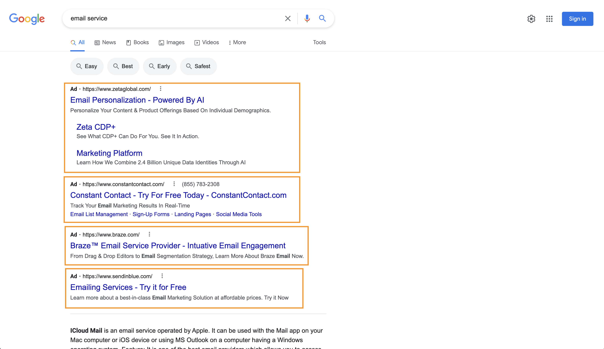
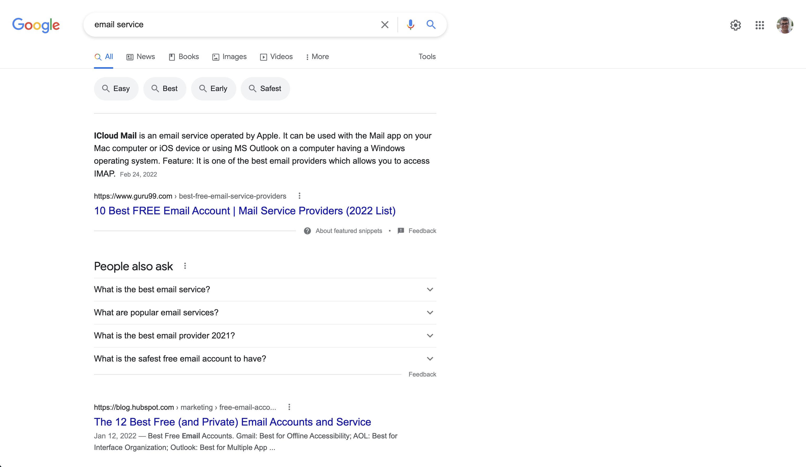

# Search Results Only Please

A google chrome extension to remove ads from google, bing, and duckduckgo search results.

## Background

Have you ever noticed that modern search results require you to scroll past a full screen of ads to hit the first real search result?

_Figure 1: Search results with a full screen of ads_

Things have gotten out of hand! Luckily, using this extension, we can ask politely for the __Search Results Only Please__! And just like that, there are no more ads cluttering your search results.

_Figure 2: Search results as they should be_

## Installation instructions

To load this extension:

1. Download or clone the contents of this repo into a folder (i.e. `~/search-results-only-please`).

2. In your chrome browser, open a tab to `chrome://extensions/`.

3. In the extensions tab, click to enable “Developer mode” in the top right.

4. In the extensions tab, click “Load unpacked extension…” and select the extension’s directory (i.e. `~/search-results-only-please`).

You should now see your extension in the list!
